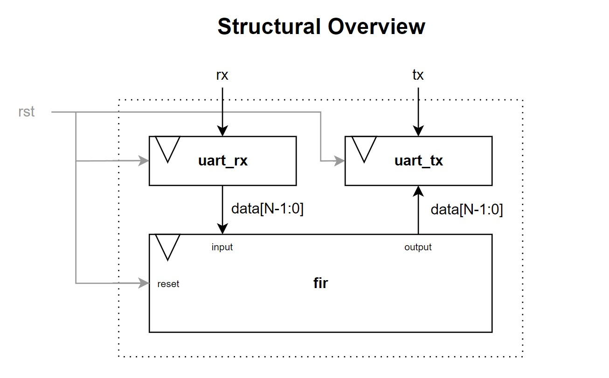
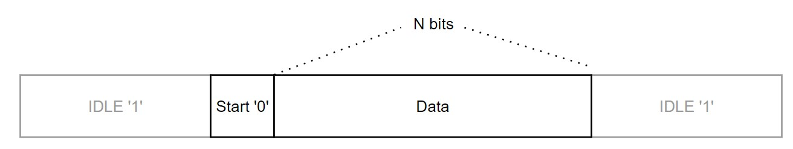

# uart_fir
An **FIR filter** with a **UART** interface, implemented in **VHDL** using *Xilinx Vivado 2018.3*.

## Structural Overview 
This mini-project is composed of three modules:
* uart_rx
* uart_tx
* fir 

Each of these modules is dedicated a VHDL design source.

### Brief Note
Since this mini-project is still under development, there may be discrepencies between the documentation and the solution provided.

## uart_rx
This module is designed to behave as a **UART receiver**. The synchronicity is given by the global `clk` signal. The module has the following generic property, which may be configured on instantiation:
* **N**: number of bits per UART packet

The UART receiver is composed of a **rotating buffer** of length **N** which is set to 0 upon reset (provided by the input `rst` signal). When the `rx` line is pulled low, the receiver begins loading the values into the buffer. Simultaneously, a counter begins, which instructs the loading to end once the full packet of **N** bits is received. When ready, the contents of the buffer are copied to the output.
#### Inputs:
* Reset signal `rst`
* Clock signal `clk`
* UART Receive Stream `rx`
#### Outputs:
* Output data `data_reg[N-1:0]`

## uart_tx
Complementary to the **uart_rx** module, this **UART transmitter** accepts input from the **fir** module before outputting the serialised equivalent. It also has the generic property:
* **N**: number of bits per UART packet

A counter counts down from **N**; when it expires, a new value is ready to be transmitted serially. Every clock cycle, one bit is transmitted onto the `tx` line.
#### Inputs:
* Reset signal `rst`
* Clock signal `clk`
* Input data `input`

#### Outputs:
* Serial output data `output`

---
### UART Packet Protocol

---

## fir
The core of this design is the **FIR filter** which accepts a stream of inputs, multiplies the inputs by a **window** of coefficients and sums the results to produce a stream of outputs. This module has the following generic properties:
* **N**: the word length, in bits *(also equal to the UART packet length)*
* **FO**: the *filter order*, which is directly related to the window length

This module contains two `std_logic_vector` arrays:
* A window of configurable coefficients `window`
* An **input buffer** `buf` to store the recent inputs

The input buffer **rotates every clock cycle** to allow new inputs to be stored.

The **FIR** module waits for a **valid UART command** occupying the LSBs of the input; these are:
* Append Input `xAA`
* Append Window Coefficient `xBB`

When one of these commands is received, the module **reads the data provided in the next cycle** and appends it, either to `window` or `buf`. This allows the window to be totally configurable, as well as allowing a **maximum input rate** of `CLK_FREQ/2`. If a slower rate is required, this responsibility is placed on the programmer to ensure the Baud rate is always maintained for the UART interface.

#### Inputs:
* Reset signal `rst`
* Clock signal `clk`
* Input data stream `input[N-1:0]`
#### Outputs:
* Output data stream `output[N-1:0]`